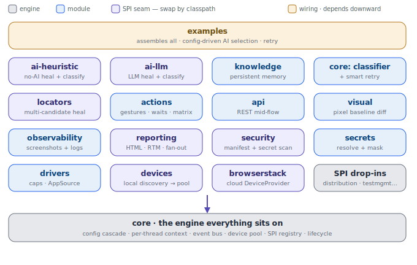

# Architecture

A Maven multi-module platform built on Appium 2.x (Java 17, TestNG). The design goal is **swap by
config + classpath, never by recompile**: `core` depends on interfaces only, and concrete
providers (devices, AI, reporters, secrets, security, drivers) are discovered at runtime via
`ServiceLoader`. The intelligence layer has **two interchangeable implementations behind one
interface** — deterministic heuristic and LLM — so the whole framework runs fully offline with
`ai.enabled=false`, and learns across runs with zero AI.

## Layers (top depends downward on `core`)

**Wiring — `examples`**
Assembles the whole stack from config + the locator repo: config-driven heuristic↔LLM selection
wrapped in persistent memory, classifier-driven retries, an end-to-end smoke test (no device),
and an on-device sample.

**Intelligence — `ai-heuristic`, `ai-llm`, `knowledge` (+ `core` classifier/retry)**
`ElementHealer` and `FailureClassifier` SPIs, each with a heuristic and an LLM implementation.
`knowledge` persists locator-success ranking, heals, failure classifications, and run history
(YAML/Markdown, git-committed); memoizing wrappers mean a model is asked at most once per unique
problem. `SmartRetryAnalyzer` retries only classified-transient failures (never assertions).

**Interaction — `locators`, `actions`, `api`**
`locators`: multi-candidate repository + success-ranked smart-find + `ElementHealer` hook (the
no-AI self-heal). `actions`: the full UiAutomator2 + XCUITest action catalogue, `ActionSupport`
platform matrix, gesture geometry, smart-sync waits + `Conditions`. `api`: REST client for
standalone suites or mid-mobile-flow use.

**Quality — `observability`, `visual`, `reporting`, `security`, `secrets`**
EventBus capture (screenshots + split logs), pixel visual baselines, the `Reporter` SPI + HTML +
Requirement Traceability Matrix, static security scanning (manifest audit + secret scan), and
secret resolution + masking.

**Setup & devices — `drivers`, `devices`, `devices-browserstack`**
Capability builders + `AppSource` + the real `DriverProvider`; local emulator/simulator discovery
feeding the `DevicePool`; a cloud `DeviceProvider` (BrowserStack) as a drop-in jar.

**Engine — `core`**
Config cascade, immutable per-thread `DriverContext` (the isolation boundary), event bus, blocking
`DevicePool`, `ServiceRegistry`, driver lifecycle, TestNG base classes, the `FailureClassifier`
SPI, and `SmartRetryAnalyzer`.

## SPI seams (purple in the diagram)

Swappable by classpath via `ServiceLoader` / config: `DriverProvider` (drivers),
`DeviceProvider` (devices, browserstack), `ElementHealer` (locators → ai-heuristic / ai-llm),
`FailureClassifier` (core → ai-heuristic / ai-llm), `Reporter` (reporting), `SecretResolver`
(secrets), `SecurityScanner` (security). Adding a provider is a thin jar against the interface —
no change to `core`.

## Dependency rules

- One direction only, acyclic. Everything depends on `core`; `ai-heuristic`/`ai-llm` also depend
  on `locators`; `devices-browserstack` depends on `devices`; `examples` depends on all.
- `core` never imports a concrete provider class — only interfaces it owns.
- Modules depend on the **narrowest** interface they need (e.g. `core` holds the driver as
  `WebDriver`, not concrete `AppiumDriver`).

## Status

15 framework modules + 1 cloud provider implemented and unit-verified (`mvn test`, no
device/network needed). Pieces that require live vendor accounts/infrastructure are defined as
SPI drop-in points: additional cloud devices (Sauce/LambdaTest), distribution
(Play/App Store/TestFlight), test-management/defects (TestRail/Jira/…), dynamic security tools
(MobSF/ZAP/Frida), real `LlmClient`/`HttpTransport` providers, and `bootstrap-cli`.

See `docs/superpowers/specs/2026-06-08-appium-framework-design.md` for the full design and each
module's `DOCS.md` for maintenance/extension guidance.
